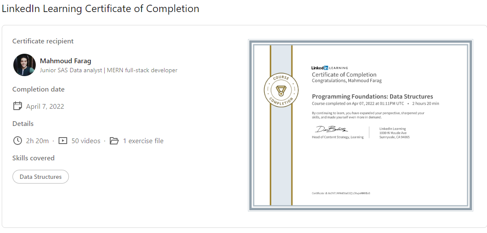

# Programming Foundations: Data Structures
### Course details
- Once you get past simple programs with one or two variables, you'll use data structures to store the values in your applications. Data structures are like containers—there's one for every kind of data. While structures like arrays and queues are sometimes taken for granted, a deeper understanding is vital for any programmer who wants to know what's going on "under the hood" and understand how the choices they've made impact the performance and efficiency of their applications. In this course, Kathryn Hodge provides an in-depth overview of the most essential data structures for modern programming. Starting with simple ways of grouping data, like arrays and structs, Kathryn gradually introduces more complex data structures, such as linked lists, stacks and queues, hash tables, and trees and graphs. Each lesson is accompanied by a real-world, practical example that shows the data structures in action. When you're finished with the course, you'll have a clear understanding of data structures and understand how to use them—in whatever language you're programming in: C#, Swift, JavaScript, Java, Python, and more.
---
### Learning objectives
- Data types: Booleans, numbers, strings, and more
- Multidimensional arrays
- Jagged arrays
- Search and sort arrays
- Linked lists
- Stacks and queues
- Hash functions and hash tables
- Trees and graphs
-------------------------------
# 😎😎Section Notes

## 👻types of data structures:

- 🐱‍🏍arrays.
- 🐱‍🏍linked-lists.
- 🐱‍🏍queues.
- 🐱‍🏍stacks.
- 🐱‍🏍hash maps.

## 🧐01.Introduction to data structure:

- 🐱‍🏍data is the information that stored or processed by a computer.

### 👻data types:

- 🐱‍🏍numbers: {whole:{short/int/long},decimal{float/double}}.
- 🐱‍🏍Boolean{true/false}.
- 🐱‍🏍Strings.

Note: primitive VS reference data types

## 🧐02.Arrays:

- 🐱‍🏍the array is a collection of elements, where each item is identified by an index or key.
- 🐱‍🏍indexes begins from zero.
- 🐱‍🏍you can create multidimensional array.

* 🐱‍🏍jagged array which can have elements of different dimensions and sizes.
* 🐱‍🏍array saved in a predefined memory area.

- 🐱‍🏍arrays in some languages sizable like{javascript, python} and in others is not like {java, c++}.

* 🐱‍🏍Big o Notation==>🤩 a Notation used to describe the performance or complexity of an algorithm.
* 🐱‍🏍O(1) Time ==>🤩 a constant time.

### big O of {insertion, deletion, searching, sorting}

- 🐱‍🏍insertion==>🤩 best-case:O(1), worst-case: O(n).
- 🐱‍🏍deletion==>🤩 best-case:O(1) , worst-case:O(n)
- 🐱‍🏍searching==>🤩 best-case:O(1) , worst-case:O(n)
- 🐱‍🏍sorting==>🤩 depends on sorting algorithm {insertion, merge,heap, bubble, bucket, radix }

## 🧐03.Linked-lists:

==> in lists the elements are liked using a pointers

- 🐱‍🏍insertion==>🤩 best-case:O(1), worst-case: O(1).
- 🐱‍🏍lists stored randomly in memory.

### linked list operations:

- 🐱‍🏍insertion==>🤩 best-case:O(1), worst-case: O(1).

* 🐱‍🏍access==>🤩 best-case:O(1), worst-case: O(n).
* 🐱‍🏍deletion==>🤩 best-case:O(1) , worst-case:O(n)
* 🐱‍🏍searching==>🤩 best-case:O(1) , worst-case:O(n)

## 04. Stacks && queues:

- 🐱‍🏍stack ==>🤩 last-in-first-out.
  - pors:
    - Reversing things.
    - keeping track of state.
    - add/remove from back of a structure.

* 🐱‍🏍queue ==> first-in-last-out.
  - Enqueue: adding item to a list.
  - Dequeue: removing item from a list.
  * see the first item in the list without removing it.

## 🧐05.Hash based:

a 🐱‍🏍Collection of key/value pairs

- 🐱‍🏍Hashing
  ==>🤩 data conversion process.

* 🐱‍🏍hashing done in one way.
* 🐱‍🏍Collisio
  n==>🤩 when two inputs produce the same hash value || when a two keys have the same hash value.
* 🐱‍🏍decrypt is two way.
* 🐱‍🏍hash map operations always take the same amount of time, regardless of the size of the hash table.

## 🧐06. Trees && Graphs:

- 🐱‍🏍Set:
  - A collection of unique items.
  - order does not matter.
  - none of the elements are duplicated.

* 🐱‍🏍binary tree==>🤩 a tree which have only two children.
* 🐱‍🏍Heap==>🤩 a data structure implemented as binary tree.
* 🐱‍🏍binary tree Big O ==>🤩 balanced:O(log(n)), unbalanced: O(n)

---

🐳🐳[linkedin-course](https://www.linkedin.com/learning/programming-foundations-data-structures-2)

