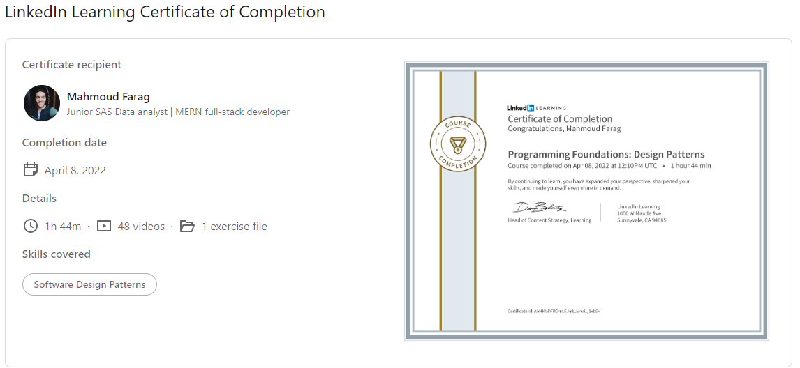

# Programming Foundations: Design Patterns
### Course details
- Design patterns are reusable solutions that solve the challenges software developers face over and over again. Rather than reinventing the wheel, learn how to make use of these proven and tested patterns that will make your software more flexible and resilient to change. This course introduces you to design patterns and takes you through several of the most used object-oriented patterns. Elisabeth Robson and Eric Freeman, coauthors of Head First Design Patterns, join forces to provide an overview of each pattern and examples of the pattern in action. Featured design patterns include the Strategy, Adapter, Observer, and Decorator patterns. Elisabeth and Eric lend these concepts a real-world context by providing code demos in Java, with the occasional example in Python and JavaScript.
---
### Learning objectives
- What are design patterns?
- Encapsulating code that varies with the Strategy pattern
- The limitations of inheritance
- Using the Adapter pattern
- Implementing the Observer pattern
- Extending behavior with composition and the Decorator pattern
- Encapsulating iteration with the Iterator pattern
- Object creation with the Factory Method pattern
- Using design principles to guide your object-oriented design
-------------------------------
# 😎😎Section Notes

## 🧐01. Design patterns:

==>🤩 its just reusing experience and pre defined solutions and algorithms
==>🤩 general solutions for a common problems.

### Object-oriented design essentials

- 🐱‍🏍Inheritance.
- 🐱‍🏍polymorphism.
- 🐱‍🏍abstraction.
- 🐱‍🏍encapsulation.

### benefits:

- 🐱‍🏍code reusability.
- 🐱‍🏍building resilient code.
- 🐱‍🏍preparing for future adding.

## 🧐02. The strategy pattern:

- 🐱‍🏍inheritance problems?
  - subclasses must inherit all super class feature (even un wanted ones )
- 🐱‍🏍interfaces problems?
  - it destroy code reusability principles.
- 🐱‍🏍Has-a{composition} better than Is-a{inheritance}?

  - classes should achieve code reuse using composition rather than inheritance form a superclass.

  caution==>🤩 in some cases composition is better than inheritance form making your code reusable.

## 🧐03. The adapter pattern:

==>🤩 a glue code/ interface which used to adapt two different classes/interfaces without chaning it.
==>🤩 this pattern converts the interface of a class into another interface that clients expect. it allows classes to work together that could not otherwise because of incompatible interfaces.

## 🧐04. The Observer pattern:

==>🤩 loosely coupled {have little knowledge about each other} patterns which means that a two classes interact with each other without any direct dependency which also means if you remove a class form the sys, it still working fine !

==>🤩 it defines a one-to-many dependency between objects so that when one object changes state, all of its dependents are notified and updated automatically

## 🧐05. The Decorator pattern:

### the Open-closed Principle:

==>🤩 classes should be open for extension but closed for modification.

- 🐱‍🏍inheritance drawbacks:
  - powerful, but it can lead to inflexible designs.
  - all classes inherit the same behavior.
- 🐱‍🏍composition advatanges:
  - we can still inherit behavior.
  - we can make dynamic runtime decisions.
  - we can add new behavior without altering existing code.
  - we can include behaviors not considered by the creator.

## 🧐06. The Iterator pattern:

==>🤩 provides a way to access the elements of an aggregate object sequentially without exposing its underline representation.

- 🐱‍🏍how to iterate over an aggregate Object:
  - ask object for its iterator.
  - use the iterator to iterate through the items in the aggregate.
  - iteration code now works with any kind of aggregate object

* 🐱‍🏍single responsibility principle
  ==🤩> the class should have only one reason to change.

## 🧐07. The Factory pattern:

==>🤩 its defines an interface for creating an object, but lets subclasses decide which class to instantiate. factory method lets a class defer instantiation to subclasses.
 

🐳🐳[linkedin-course](https://www.linkedin.com/learning/programming-foundations-design-patterns-2?contextUrn=urn%3Ali%3AlyndaLearningPath%3A56db2b643dd5596be4e4989b)

