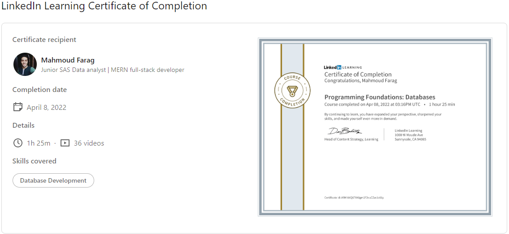

# Programming-Foundations-Databases
### Course details
- Once you get beyond basic programming, you'll need a database. Databases provide a consistent, organized structure for storing and retrieving large amounts of data. They allow programmers to build more complex applications that can take orders, process payments, make recommendations, authenticate users, and more. This course provides the foundation you need to get started in database programming. Explore the terminology: normal forms, ACID and CRUD, referential integrity, transactions, records, and tables. Learn what role keys and unique values play in a relational model. Discover how to design the best system to contain your data, starting with the tables and relationships at the core of your database. Find out how to write queries to extract the data you need, and how to juggle the different demands of storage, access, performance, and security. Instructor Scott Simpson provides practical examples and clear explanations that will help you design databases that can withstand the needs of your applications, your data, and your users.
---
### Learning objectives
- Relational databases
- Keys and unique values
- Planning a database
- Creating tables
- Defining relationships
- Normalization and denormalization
- Writing queries
- Sorting results
- Joining tables
- Modifying data
-------------------------------
# 😎😎Section Notes

==>🤩 databases is a place to organize, easely access, protect, use predefined schema and manage your data

### types of databases:

- 🐱‍🏍Relational DBs.
- 🐱‍🏍non- Relational DBs.

### 🙄DBMS {Data-Base-Management-System}?

==>🤩 a software like sql, mysql pr sql server used to interact with DBs.

### 🙄DBs benefits?

- 🐱‍🏍provide a structure for data.
- 🐱‍🏍allow enforcement of rules for data.
- 🐱‍🏍protect data from unauthorized access or changes.

### 🙄Schema?

==>🤩 how data in DB will be organized

## 🧐01. DB Foundation:

- 🐱‍🏍Relation DB?
  ==>🤩 a set of connected tables .

* 🐱‍🏍primary key?
  ==>🤩 a unique identifier for a specific row.
* 🐱‍🏍composite key?
  ==>🤩 two or more fields taken together to act as a unique identifier.
* 🐱‍🏍foreign key?
  ==>🤩 a key which is a primary key in another table.
* 🐱‍🏍types of DBs relationships?
  - 🐱one-to-one.
  - 🐱one-to-many.
  - 🐱many-to-many
* 🐱‍🏍transaction?
  ==>🤩 a set of steps, all must be processed as a unite.

* 🐱‍🏍ACID{Atomic-Consistent-Isolated-Durable}?
  a set of rules to be able to accomplish a successful transaction

  - 🐱Atomic:
    ==>🤩 transaction must not be indivisible.
  - 🐱Consistent:
    ==>🤩 you must leave DB valid and in consistent state{keep integrity rule save}.
  - 🐱Isolated:
    ==>🤩 only one thing processed at single time unite.
  - 🐱Durable:
    ==>🤩 any information must be saved into the DB/ DB must be updated.

  NOTE: ACID rules are handled by DBMS.

* 🐱‍🏍SQL {Structured Query Language}?

  - 🐱to write commands and instruction to interpret and interact with data

    ==>🤩 in this role, sql is called a data manipulation language{DML}.

  - 🐱it also offer a syntax to manage, create modifying tables and controlling access to tables

    ==>🤩 in this role sql is called a data definition language {DDL} and data control language {DCL}.

* 🐱‍🏍CRUD {create-read-update-delete}

## 🧐02. Tables:

### 🙄Entity Relationship Diagram?

==>🤩 a diagram that uses tables, fields, and relationships to plan a DB.

- 🐱‍🏍using camelCase for naming tables

* 🐱‍🏍data types?
  - strings.
  - numbers.
  - boolean.
  - date.

## 🧐03. Relationships:

- 🐱‍🏍one-to-many?
  ==>🤩 one table connected with more than table

- 🐱‍🏍many-to-many?
  ==>🤩 associate more one thing with more than one thing.
- 🐱‍🏍one-to-one?
  ==>🤩 associate only one table with another one.

### 🙄Referential integrity?

==>🤩 DBs are aware of relationships and want not allow a user to modify data in a way that violates those relationships.

## 🧐04. Database Optimization:

==>🤩 a way to reduce redundancy and improve data integrity  
==>🤩 it done in 3 phases

- 🐱‍🏍First normal form {1NF}?
  ==>🤩 values in each cell should be atomic and tables should have no repeating groups{removing duplicate}.

* 🐱‍🏍Second normal form {2NF}?
  ==>🤩 no value in a table should depend on only part of a key that can be used ti uniquely identify a row.

* 🐱‍🏍Third normal form {3NF}?
  ==>🤩 values should not be stored if they can be calculated from another non-key field.

### 🙄Denormalization?

==>🤩 the process of intentionally duplicating information in a table, in violation of normalization rules.
==>🤩 it done after normalization phase to enhance DB creation

## 🧐05. Querying a Database:

- 🐱‍🏍create tables {create table}.

* 🐱‍🏍select certain data {select \* from names}.
* 🐱‍🏍filtering data {select name from names where nam='ali'}.
* 🐱‍🏍sorting data {orderby }
* 🐱‍🏍joining tables {left-join/right-join}

## 🧐06. Querying a Database:

### 🙄stored procedures?

- 🐱‍🏍a series of commands stored on the DB.
- 🐱‍🏍allow reuse of long or detailed queries instead of writing them for eac use.
- 🐱‍🏍provide a safe way to deal with sensitive data.
   

🐳🐳[linkedin-course](https://www.linkedin.com/learning/programming-foundations-databases-2)

