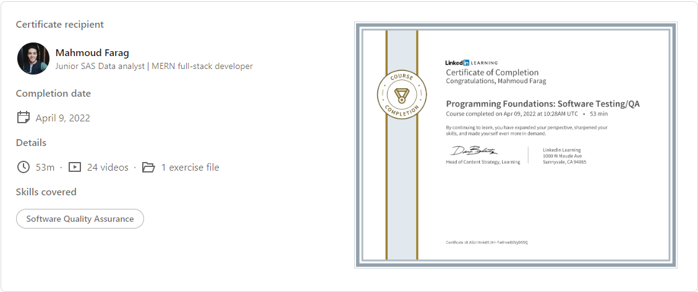

# Programming Foundations: Software Testing/QA

### Course details

- Quality assurance (QA) engineering can mean many different things to different people. In this course, learn about QA practices within the context of a software engineering project. Instructor Meaghan Lewis demonstrates the different kinds of testing QA focuses on and how QA fits into the software development life cycle (SDLC). Meaghan explores the areas you'll likely want to test and continuously monitor to ensure increasing improvements to your product. Plus, she goes over some of the mechanisms used to communicate the overall health of a product. Upon wrapping up this course, you'll be able to look at whatever you're working on, think critically about how the pieces fit together, and identify ways to help your team meet quality goals with every release.

---

### Learning objectives

- How QA fits into the software development life cycle (SDLC)
- Setting expectations and goals
- Making a test plan
- Incorporating box testing into your process
- Executing manual testing
- Leveraging UI automation testing
- Identifying, reporting, and prioritizing bugs

---

# 😎😎 Section Notes

### 🙄 QA Quality-Assurance?

==>🤩 a systematic process used to determine wether a product meets specifications or not.

## 🧐 01. The Role of QA:

### 🙄 roles of responsibilities?

- 🐱‍🏍technical aptitude?
  - manual testing.
  - automated testing.
  - programming.
  - scripting.
- 🐱‍🏍business knowledge?
  - feature scoping.
  - test planning.
  - test-case management.
  - bug management.
- 🐱‍🏍devops principles?
  - configure tools.
  - set up ci.
  - set up test environments.
  - automate processes.
- 🐱‍🏍process and release expertise.
  - define and improve testing practices.
  - optimize release process.

### 🙄 SDLC process?

plan==>define==>design==>build==>test==>deploy {applied in leaner way}

- 🐱‍🏍plan?
  - identify risks.
  - identify use-cases.
- 🐱‍🏍define?
  - write specifications and acceptance criteria.
  - decide what is in scope.
  - write test strategy.
- 🐱‍🏍design && build?
  - solidify test scenarios.
  - get feedback on scenarios from team
  - manual and automation tests.
- 🐱‍🏍test?
  - acceptance testing.
- 🐱‍🏍deploy?
  - validate functionality.
  - release.
  - test in production.

### 🙄 set expectation and gaols?

- 🐱‍🏍build a relationship with your teammates and sharing knowledge.
- know the responsibilities of each role.
- 🐱‍🏍collaborate.

## 🧐 02. Test Planning:

### you have to create a test strategy/plan

### 🙄 acceptance criteria?

==>🤩 conditions that a software product must satisfy to be accepted by a stakeholder

## 🧐 03. Types of Testing QA Focuses On:

### 🙄 testing types?

- 🐱‍🏍Box testing?
  _ Black box?
  manual/UI-automation/performance testing.
  _ Gray box?
  integration testing/trigger some action in UI \* White box?
  focus in internal features like unit/system testing.

- 🐱‍🏍Manual testing?
  ==>🤩 before testing you have to identify both typical and nontypical use cases.
- 🐱‍🏍UI-automation testing.
  ==>🤩 scenarios can be executed repeatedly and catch regressions introduced in the application.
- 🐱‍🏍Integration testing.
  ==>🤩 how app features/components interact with each other.

- 🐱‍🏍performance testing?
  ==>🤩 how a system performs under load/ to make sure and application runs fast and well.
- 🐱‍🏍Security testing.
  ==>🤩 exposes problems in the app that cause unexpected behavior crashes.

### 🙄 load testing?

    ==> checks the application's ability to perform under user loads.

### 🙄 endurance testing?

    ==>🤩 check how an application handles load over time/its goal to check for system problems.

### 🙄 stress testing?

    ==>🤩 involves testing an app under extreme workloads. it is used for testing scalability/its goal to identify app break-points && software stability{when it fail && hwo to recover}.

### 🙄 sql injection?

    ==>🤩 used to insert DB statements into text fields and expose app info.

### 🙄 DOS {Denial-Of-Service}?

    ==> is an attack where hackers try to take down an app servers or network.

### 🙄 vulnerabilities?

==>🤩 in dependencies can cause massive security

## 🧐 04. Bug Reporting:

==>🤩 incorrect / unexpected behavior

### 🙄 bug reporting systems tools?

    jira/github/bugzilla

### 🙄 severity?

==>🤩 how impactful the bug is to the business.

### 🙄 priority?

==>🤩 how fast the bug should be fixed.
 

🐳🐳[linkedin-course](https://www.linkedin.com/learning/programming-foundations-software-testing-qa)

