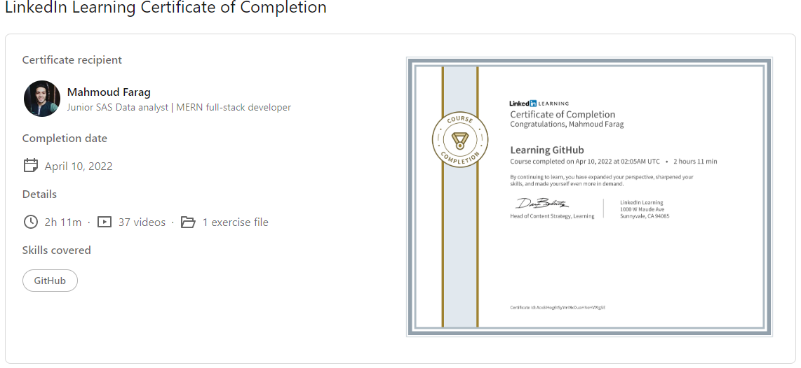

# Learning GitHub
### Course details
- GitHub is the industry-standard tool for collaborating on and sharing code. It’s popular among software developers, project managers, designers, and students for its flexibility and control. This course introduces GitHub and Git, the version control system that GitHub is built upon. Instructor Aaron Stewart, a training content specialist at GitHub, explains the benefits of version control, how to navigate GitHub and the command line, how GitHub and Git are related, and the best practices for communication and collaboration on GitHub. Aaron also reviews the most common tasks, such as branching, commits, and pull requests, and shows you how to create a simple local project and move it to GitHub to share with your team. Once you have completed the course, you should be able to immediately start using Git and GitHub to manage your own code.

-------------------------------

# 😎😎Section Notes

🐋🐋 for more info please go [HER](https://youtube.com/playlist?list=PLtxOBbrOOPH4zeJLOdRNrP4pGft2IfMgo)

🐋🐋 git&&github cheat-sheet go [HER](https://education.github.com/git-cheat-sheet-education.pdf)

## 🧐01. The Basics of Working on GitHub:

### 🙄what is git?

==>🤩 a free open-source distributed version control system{VCS} designed to handle everything from small to large projects with speed and efficiency.

### 🙄github?

==>🤩 a collaboration platform built on top of git.

### 🙄issues?

==>🤩 a way to track bugs, feature requests, any thing you need to discus without actually attaching code to it.

### 🙄pull requests?

==>🤩 a way to represent a change in your repo such as adding, modifying, or deleting files.
==>🤩 you want to show changes you have made and add them to the production branch on github.

### 🙄projects?

==>🤩 allow you to visualize your work with kanban-style boards.

### 🙄wiki?

==>🤩 a way to add more docs to your project.

### 🙄insights?

==>🤩 a quick overview about repository health or pulse, her you can see commit, code frequency, dependency graphs and contributions

### 🙄git workflow?

🐋🐋 please learn more from [HER](https://www.youtube.com/watch?v=7OTrHx56GfE&ab_channel=SemiColonAcademy)

## 🧐02. Working Locally with the Command Line:

### 🙄why it is a good practice to use the command line?

==>🤩 as you have the full freedom and flexibility to make changes you need.

### 🙄git configuration levels?

- 🐱‍🏍--system?
  ==>🤩 configurations applied to all users in your computer.
- 🐱‍🏍--global?
  ==>🤩 based on user level, only applied to a certain user
  some commands {
  && git config --global user.name ''
  && git config --global user.email ''
  }
- 🐱‍🏍--local?
  ==>🤩 applied only on a certain repository

### 🙄github pages?

==>🤩 allows you to host a website directly from the contents of your project repo on github{settings--> github pages-->source-->main branch}

### 🙄git status?

==>🤩 a git command to check your local repo changes

### 🙄the 3 states of a file?

- 🐱‍🏍working
- 🐱‍🏍staging{by using add command}
- 🐱‍🏍history {by using commit command}

## 🧐03. Working Locally with GitHub Desktop:

### 🙄tracking Branch?

- 🐱‍🏍checking out a local branch automatically creates a tracking branch.
- 🐱‍🏍a local branch with a direct relationship to a remote branch.
- 🐱‍🏍git knows which branch to push to

### 🙄available IDEs ?

- 🐱‍🏍VSCode.
- 🐱‍🏍intelliJ.
- 🐱‍🏍Atom.
- 🐱‍🏍Xcode.
- 🐱‍🏍Eclipes.
- 🐱‍🏍Gitkraken

### 🙄push?

==>🤩 upload your local changes to github.

### 🙄pull?

==>🤩 download any changes from github into the local repository.

### 🙄merge?

==>🤩 to combine two or more branches with the main branch.

## 🧐04. Moving Your Project to GitHub:

### 🙄.gitignore?

==>🤩 to ignore certain files from uploading to github{cloud}.

### 🙄public VS private rpo?

==>🤩 public means that any one can access and see your repo, private vis versa.

### 🙄open-source?

==>🤩 a software/projects/ tools that any one can view, modify, and distribute.

## 🧐05. Working with Others on GitHub

### 🙄how to create a readme.md?

==>🤩 using html tags like h1/h2/img....
==>🤩 '[]{}' for adding url/img
==>🤩 emphasis using _text_/ **text **/ _text_/ **text**
 

🐳🐳[linkedin-course](https://www.linkedin.com/learning/learning-github)

