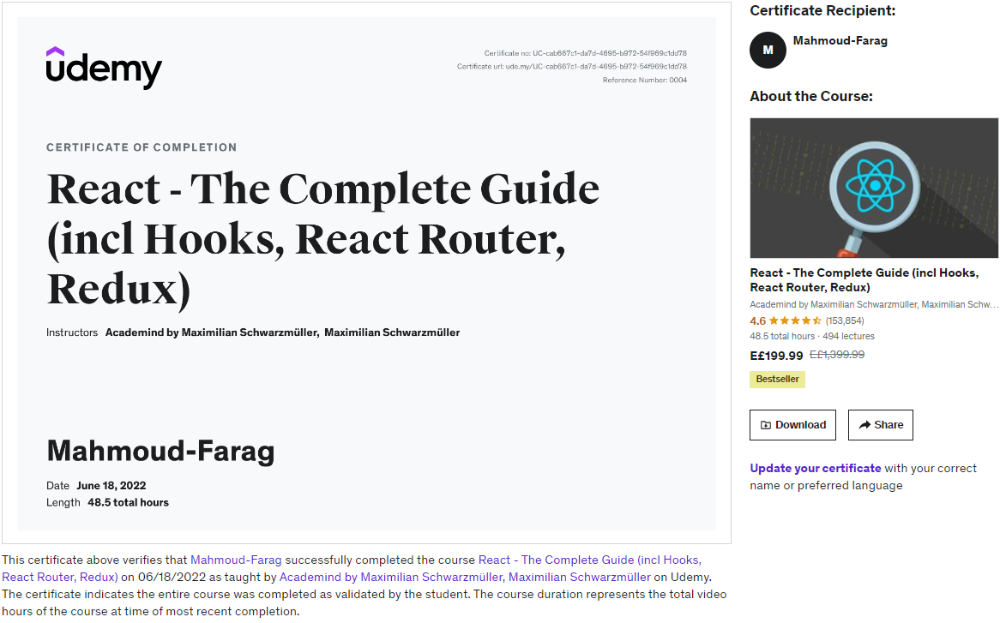

# 🤍🤍 React - The Complete Guide (incl Hooks, React Router, Redux)

### 💘Dive in and learn React.js from scratch! Learn Reactjs, Hooks, Redux, React Routing, Animations, Next.js and way more! :Maximilian Schwarzmüller

🐳🐳[the Course on udemy](https://www.udemy.com/course/react-the-complete-guide-incl-redux/)

### ✅Section 1: Getting Started

### ✅Section 2: JavaScript Refresher

### ✅Section 3: React Basics & Working With Components

### ✅Section 4: React State & Working with Events

### ✅Section 5: Rendering Lists & Conditional Content

### ✅Section 6: Styling React Components

### ✅Section 7: Debugging React Apps

### ✅Section 8: Time to Practice: A Complete Practice Project

### ✅Section 9: Diving Deeper: Working with Fragments, Portals & "Refs"

### ✅Section 10: Advanced: Handling Side Effects, Using Reducers & Using the Context API

### ✅Section 11: Practice Project: Building a Food Order App

### ✅Section 12: A Look Behind The Scenes Of React & Optimization Techniques

### ✅Section 13: An Alternative Way Of Building Components: Class-based Components

### ✅Section 14: Sending Http Requests (e.g. Connecting to a Database)

### ✅Section 15: Building Custom React Hooks

### ✅Section 16: Working with Forms & User Input

### ✅Section 17: Practice Project: Adding Http & Forms To The Food Order App

### ✅Section 18: Diving into Redux (An Alternative To The Context API)

### ✅Section 19: Advanced Redux

### ✅Section 20: Building a Multi-Page SPA with React Router

### ✅Section 21: Deploying React Apps

### ✅Section 22: Adding Authentication To React Apps

### ✅Section 23: A (Pretty Deep Dive) Introduction to Next.js

### ✅Section 24: Animating React Apps

### ✅Section 25: Replacing Redux with React Hooks

### ✅Section 26: Testing React Apps (Unit Tests)

### ✅Section 27: React + TypeScript

### ✅Section 28: Optional: React Hooks Introduction & Summary

### ✅Section 29: Optional: React Summary & Core Feature Walkthrough

## **Projects**

### 🐳🐳 [section3-project](https://react-course-section3.netlify.app)

### 🐳🐳[section4-project](https://react-course-section4.netlify.app)

### 🐳🐳[section5-project](https://react-course-section5.netlify.app)

### 🐳🐳[section6-project](https://react-course-section6.netlify.app)

### 🐳🐳 [section7-project](https://react-course-section7.netlify.app)

### 🐳🐳[section8-project](https://react-course-section8.netlify.app)

### 🐳🐳[section9-project](https://react-course-section9.netlify.app)

### 🐳🐳[section10-project](https://react-course-section10.netlify.app/)

### 🐳🐳[section11-project](https://react-course-section11.netlify.app/)

### 🐳🐳[section12-project](https://react-course-section12.netlify.app/)

### 🐳🐳[section13-project](https://react-course-section13.netlify.app/)

### 🐳🐳[section14-project](https://react-course-sectio14.netlify.app/)

### 🐳🐳[Section15-project](https://react-course-section15.netlify.app)

### 🐳🐳[Section16-project](https://react-course-section16.netlify.app)

### 🐳🐳[section17-project](https://react-course-section17.netlify.app)

### 🐳🐳[section18-project](https://react-course-section18.netlify.app/)

### 🐳🐳[section19-project](https://react-course-section19.netlify.app)

### 🐳🐳[section20-project](https://react-course-section20.netlify.app/)

### 🐳🐳[section22-project](https://react-course-section22.netlify.app)

### 🐳🐳[section23-project](https://nextjs-project-ashen-beta.vercel.app/)

### 🐳🐳[section24-project](https://react-course-section24.netlify.app/)

### 🐳🐳[section25-project](https://react-course-section25.netlify.app)

### 🐳🐳[section27-project](https://react-course-section27.netlify.app)

### 🐳🐳[section28-project](https://react-course-section28.netlify.app/)

### 🐳🐳[section29-project](https://react-course-section29.netlify.app)

## **certification**

## 🥳.
